<div align="center">

# Zero Code Studio


**一个支持任务计划、上下文压缩与可视化生成过程的 AI 代码生成平台**

基于 LangChain4j 与 LangGraph4j 构建，支持工具调用生成、Workflow 编排  
内置结构化 TODO 任务计划、三层上下文压缩和过程可视化，覆盖「生成 → 修改 → 预览 → 部署」完整链路。


[快速开始](#快速开始) • [核心设计](#核心设计) • [核心能力](#核心能力) • [技术架构](#技术架构) • [工作流](#工作流) • [上下文压缩机制](#上下文压缩机制) • [缓存与限流](#缓存与限流) • [部署机制](#部署机制)


</div>

---

## 项目简介

Zero Code Studio 是一个以工程化为目标的 AI 代码生成平台。  
它不仅能生成网页代码，还能在生成过程中展示模型思考、工具调用、TODO 计划推进和最终回复，并将每一轮对话沉淀为可回放的结构化事件。

当前版本重点增强了长链路 Agent 能力：通过 `updatePlan` 管理带依赖关系的任务计划，通过 Redis + MySQL 保留运行态记忆和事件日志，并通过三层上下文压缩降低长对话中的 token 压力。


---

## 核心设计

- **双引擎架构**：同一入口切换 `LangChain4j 工具调用模式`与 `LangGraph4j 工作流编排模式`，简单场景走工具循环快速出结果，复杂场景走图编排实现`路由 → 生成 → 质检 → 构建`的多步链路。

- **Agent 任务计划**：模型通过 `updatePlan` 工具维护带 DAG 依赖关系的结构化计划，后端持久化到 Redis 并校验依赖合法性，前端实时渲染进度面板；连续多轮工具调用未更新计划时自动注入提醒（Nag 机制）。

- **三层上下文压缩**：Layer 1 自动将旧工具结果替换为占位符；Layer 2 超 token 阈值时调用 LLM 生成保留变更对照的结构化摘要；Layer 3 支持手动触发即时压缩。完整记录始终保留在 MySQL 事件日志中。

- **流式可观测**：SSE 实时推送`思考过程`、`工具调用`、`计划更新`、`最终回复`四类事件，前端分层渲染，生成过程全程可见。

- **生成-修改-部署闭环**：支持 `HTML / 多文件 / Vue 工程`三种代码类型生成，可视化选中元素定点修改，生成后自动构建并部署到本地可访问地址。

---

- 做了两种生成模式：`标准模式(LangChain4j)` 和 `工作流模式(LangGraph4j)`，同一入口可切换。
- 做了`智能路由`与`模型分层`：`HTML / 多文件（原生 CSS + JS）`走轻量模型；`Vue 工程化生成`走重模型与`推理模式`，并支持展示`推理过程`与`工具调用`。
- 做了`任务计划机制`：通过 `updatePlan` 工具让模型维护结构化 TODO，支持任务依赖、Redis 持久化和前端进度面板展示
- 做了`工具调用能力`：支持`读目录`、`读文件`、`写文件`、`改文件`、`删文件`、`退出`。
- 做了`上下文压缩机制`：支持工具结果微压缩、自动摘要压缩和手动压缩，并在摘要中保留关键修改前后值，避免长对话上下文膨胀。
- 做了`记忆系统`：`Redis`短期记忆 + `MySQL`长期事件日志，可回放可重建。
- 做了`LangGraph4j 工作流编排`：`图片并发收集` → `提示增强` → `智能选择路由` → `生成` → `质检` → `构建`。
- 做了`流式对话闭环`：`SSE`实时返回，前端边生成边展示。
- 做了`DeepSeek V4-Pro 适配`：用同一个 `deepseek-v4-pro` 模型承载普通对话与推理对话，通过 `thinking.type` 控制是否开启思考，并支持 `reasoning_effort` 调整推理强度。
- 做了`微服务支持`：按`应用服务`、`用户服务`、`截图服务`做了微服务拆分，并基于 `Dubbo + Nacos` 实现服务注册发现与远程调用。
- 做了`过程可视化`：前端分层展示`思考过程`、`工具调用`、`最终回复`。
- 做了`局部修改能力`：前端支持选取局部元素修改
- 做了`本地部署闭环`：生成后自动构建并发布到本地可访问地址。
- 做了`可视化编辑`：在预览页点选元素，带`选择器`发起定点修改。
- 做了`接口限流保护`：基于 `Redis + Redisson` 的分布式限流，按用户 / IP / API 维度控制请求频率。

---

## 核心能力

### 1) LLM 工程能力


- 工作流编排：支持基于 `LangGraph4j` 对 LLM 行为进行工作流级编排（路由、生成、质检、构建）。
- 工具调用：支持多工具协同执行，完整保留工具请求与结果。
- 任务计划：模型通过 `updatePlan` 工具提交结构化 TODO 计划，支持 `pending / in_progress / completed` 状态流转。
- 任务依赖：计划条目支持 `deps` 依赖声明，后端校验依赖任务完成后才允许进入 `in_progress`。
- 计划持久化：`PlanTracker` 基于 Redis 保存每个应用的计划状态，并通过 Nag 机制提醒模型及时更新计划。
- 上下文压缩：支持工具结果微压缩、自动摘要压缩和手动压缩，减少长链路 Agent 的上下文膨胀。
- 变更回溯：摘要压缩时保留关键修改的「修改前 → 修改后」对照，降低压缩后丢失回退信息的风险。
- 推理过程落库：支持思考内容（reasoning）与工具轨迹分层展示。
- 幂等防重：基于 `clientRequestId` 防止浏览器 SSE 自动重连造成重复请求 LLM。
- 多模型配置：支持 OpenAI 兼容接口模型切换（如 DeepSeek / Qwen / GLM）。

### 2) 业务能力

- 智能生成：支持 HTML、多文件、Vue 项目多种代码生成类型。
- 精准修改：支持基于选择器的定点修改和 patch 应用。
- 可视化编辑：在预览 iframe 中选中元素并自动注入上下文提示。
- 一键部署：生成后自动部署到本地静态访问地址，并异步生成封面截图。
- 接口限流：对 AI 对话接口进行用户维度频控（当前 `10 次 / 60 秒`），防止高频请求冲击服务。
- 精选缓存：首页的精选应用分页结果写入 Redis（前 10 页缓存，TTL 5 分钟），并在精选数据变更时主动失效。

---

## 技术架构

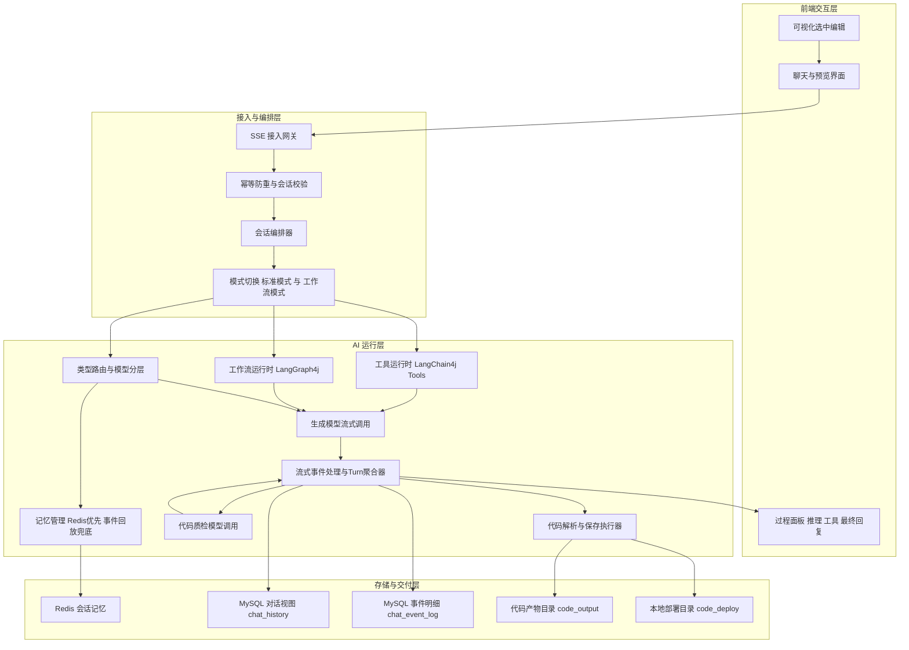

### 端到端数据流

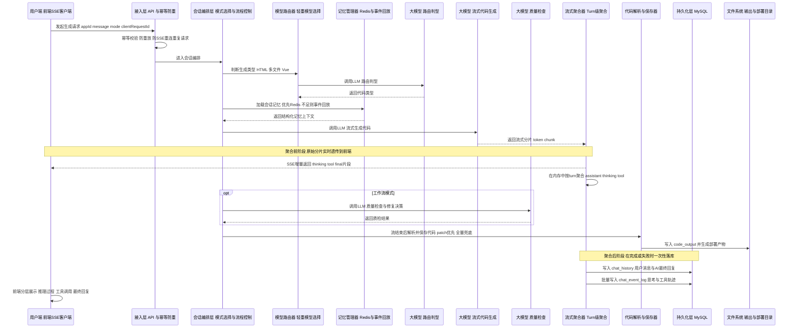

> 说明：图中采用抽象角色表达，避免与具体类名绑定；对应实现仍是同一条工程化链路：幂等防重、记忆加载、流式分片、对话轮次聚合、结束落库、文件落盘。

### 关键数据对象

- `turnId`：单轮会话主键，贯穿 SSE 聚合与最终落库。
- `memoryId`：`appId_codeGenType`，用于区分不同生成类型的会话记忆。
- `chat_history`：用户可读对话视图，保存 user / assistant 最终消息。
- `chat_event_log`：结构化事件事实表，保存 `USER_MESSAGE`、`THINKING`、`TOOL_REQUEST`、`TOOL_RESULT`、`ASSISTANT_FINAL`。

### HTML 落盘链路中的设计模式

- `Facade`：`AiCodeGeneratorFacade` 统一封装“生成 + 解析 + 保存”流程。
- `Executor 分发`：`CodeParserExecutor` / `CodeFileSaverExecutor` 按 `CodeGenTypeEnum` 分发 HTML 与多文件实现。
- `Template Method`：`CodeFileSaverTemplate` 固化保存骨架，子类只实现 `saveFiles` 细节。
- `Patch 优先策略`：`HtmlCodeParser` 先解析 patch 协议，再回退完整 HTML；`HtmlCodeFileSaverTemplate` 优先应用 patch，再兜底全量写入。
- `Reactive 聚合`：`StreamHandler` 在 `doOnNext/doOnComplete/doOnError` 中完成流式聚合与一致性落库。

---

## 工作流

### 工作流主链路（LangGraph）

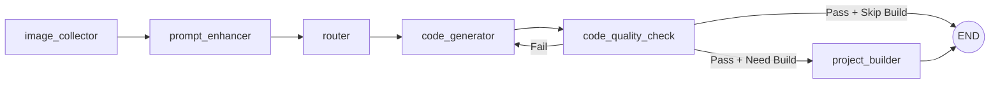

### Agent 工具调用循环

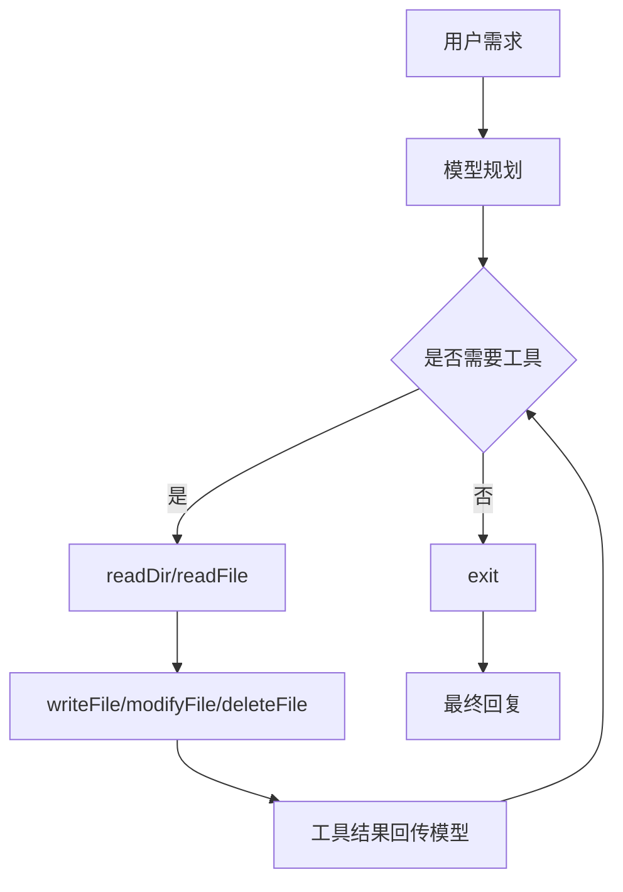

---

## 工具清单

| 工具名       | 作用                       |
| ------------ | -------------------------- |
| `readDir`    | 读取目录结构               |
| `readFile`   | 读取文件内容               |
| `writeFile`  | 写入文件                   |
| `modifyFile` | 替换指定内容实现局部修改   |
| `deleteFile` | 删除文件（含重要文件保护） |
| `exit`       | 结束工具调用循环           |

---

## 记忆与事件系统

- `chat_history`：用户与 AI 的对话视图，便于历史展示。
- `chat_event_log`：记录每轮关键事件（用户消息、思考、工具请求、工具结果、最终回复）。
- Redis 作为短期会话记忆，MySQL 作为长期事实日志。
- 当 Redis 记忆丢失时，可从 `chat_event_log` 回放重建关键上下文。

---

## 上下文压缩机制

项目内置三层上下文压缩机制，在保证对话质量的前提下实现"无限会话"：

### 压缩架构

```
Layer 1: 微压缩（持久化）    —— 自动压缩旧工具执行结果，保留最近 8 条
    ↓
Layer 2: 自动摘要压缩（LLM）  —— 当 token 超过阈值时，调用 LLM 生成对话摘要
    ↓
Layer 3: 手动压缩（API）      —— 用户主动触发，立即执行压缩
```

- **Layer 1**：每次模型调用前，自动将旧的工具执行结果替换为 `[已执行: toolName]` 占位符，保留最近 8 条完整结果。
- **Layer 2**：估算当前上下文 token 数，超过阈值后调用轻量模型生成摘要，用一条摘要消息替换全部历史。
- **Layer 3**：通过 `POST /api/app/chat/compact?appId={appId}` 接口手动触发压缩。

完整的对话记录始终保留在 MySQL `chat_event_log` 表中，压缩只影响发送给LLM中的实时上下文。

### 压缩阈值配置

压缩阈值在 `application-ai.yml` 中配置，**不需要修改代码**：

```yaml
# 上下文压缩配置
context-compaction:
  # 触发自动压缩的 token 估算阈值
  # 建议设为所用模型最大上下文长度的 80%
  # 例如：DeepSeek V4-Pro 最大上下文 1M tokens → 800000
  #       GLM-4 最大上下文 128K tokens → 102400
  #       Qwen 最大上下文 128K tokens → 102400
  token-threshold: 800000
  # 送入摘要模型的最大字符数（避免摘要请求本身超长）
  max-summary-input-chars: 300000
```

**如何设置阈值：**

1. 查看你所使用的大模型的最大上下文长度（例如 DeepSeek V4-Pro 为 1M tokens）。
2. 将 `token-threshold` 设为最大上下文的 **80%**（预留 20% 给当前轮的输入输出）。
3. Token 估算方式：`总字符数 / 3`（中英混合场景的粗略估算）。

| 模型            | 最大上下文  | 推荐阈值（80%） |
| --------------- | ----------- | --------------- |
| DeepSeek V4-Pro | 1M tokens   | 800000          |
| GLM-4           | 128K tokens | 102400          |
| Qwen-Plus       | 128K tokens | 102400          |

也可以通过环境变量覆盖：

```bash
export ZERO_CODE_COMPACTION_TOKEN_THRESHOLD=102400
export ZERO_CODE_COMPACTION_MAX_SUMMARY_CHARS=300000
```

### 压缩摘要策略

压缩时，LLM 会生成结构化摘要，确保保留以下关键信息：

- 每次文件修改的**前后值对照**（例如：`标题从『静夜思』→『测试』`），确保可回退。
- 当前项目状态与结构。
- 用户的核心需求和偏好。
- 尚未完成的任务。
- 按时间顺序的变更历史链。

### 压缩前后对比

压缩不会删除完整历史。完整事件始终保存在 MySQL `chat_event_log` 中；压缩只影响下一轮发送给 LLM 的 实时上下文。

#### Layer 1：工具结果微压缩

微压缩只处理较旧的 `ToolExecutionResultMessage`。最近 8 条工具结果保持原文，旧的大段工具结果会替换为占位符。

| 阶段 | 内容形态 | 目的 |
| --- | --- | --- |
| 压缩前 | 保存完整工具结果，例如 `readFile` 返回整段文件内容 | 方便模型理解刚刚读取到的具体内容 |
| 压缩后 | 保留工具名和调用痕迹，例如 `[已执行: readFile]` | 告诉模型“这个工具执行过”，但不再重复占用大量 token |

压缩前：

```json
{
  "id": "call_00_zWOMowxyqSEa6bEOGYx2hWfD",
  "toolName": "readFile",
  "text": "export const articles = [ ... 大段文件内容 ... ]",
  "type": "TOOL_EXECUTION_RESULT"
}
```

压缩后：

```json
{
  "id": "call_00_zWOMowxyqSEa6bEOGYx2hWfD",
  "toolName": "readFile",
  "text": "[已执行: readFile]",
  "type": "TOOL_EXECUTION_RESULT"
}
```

#### Layer 2：自动摘要压缩

当上下文超过 `context-compaction.token-threshold` 后，系统会调用摘要模型，将多轮历史压缩成一条摘要消息。

压缩前：

```text
用户消息 + AI 回复 + thinking + 工具请求 + 工具结果 + 多轮文件修改记录 ...
```

压缩后：

```text
[对话已压缩，完整记录保留在事件日志中]

1) 已完成的操作
- 创建了 package.json、vite.config.js、index.html、src/main.js 等文件
- 将首页标题从「静夜思」修改为「测试」

2) 当前项目状态
- 当前是 Vite + Vue3 项目
- 已包含路由、页面组件、公共样式和模拟数据

3) 用户需求和偏好
- 需要个人博客
- 需要文章列表、详情页、分类、搜索、评论和关于页面

4) 尚未完成的任务
- 无，当前需求已完成
```

#### 压缩后仍然保留的信息

| 信息类型 | 是否保留 | 说明 |
| --- | --- | --- |
| 用户核心需求 | 保留 | 摘要中保留用户目标、偏好和约束 |
| 当前项目结构 | 保留 | 保留关键文件、组件、路由和页面状态 |
| 修改前后值 | 保留 | 使用「修改前 → 修改后」格式记录，便于回退 |
| 最近工具结果 | 保留 | 最近 8 条工具结果不做微压缩 |
| 旧的大段工具结果 | 压缩 | 替换为 `[已执行: toolName]` |
| 完整原始事件 | 保留 | 始终保存在 MySQL `chat_event_log` 中 |


---

## 缓存与限流

### 限流特性（Redisson 分布式限流）

- 基于 `@RateLimit` + AOP，对接口做统一限流。
- 支持三种维度：`USER`、`IP`、`API`（按注解参数切换）。
- 当前 AI 对话接口 `/app/chat/gen/code` 限流规则：`10 次 / 60 秒 / 用户`。
- 限流器 key 统一前缀 `rate_limit:`，并在 Redis 中设置 1 小时过期，避免长期脏 key 堆积。
- 超限后返回友好提示：`AI 对话请求过于频繁，请稍后再试`。

### 精选应用缓存特性（Redis Cache）

- 精选列表接口 `/app/good/list/page/vo` 使用缓存空间 `good_app_page`。
- 仅缓存前 10 页请求（`pageNum <= 10`），避免深页低频数据占用缓存。
- `good_app_page` 单独配置 TTL 为 5 分钟（默认缓存 TTL 为 30 分钟）。
- 发生精选数据变更时主动清理缓存，避免用户命中旧数据：
  - 管理员更新应用且涉及精选状态变化时清理。
  - 用户更新精选应用信息时清理。
  - 删除精选应用时清理。

### 缓存序列化策略

- key 使用字符串序列化；value 使用 JSON 序列化并携带类型信息。
- 禁用 `null` 值缓存，减少无效缓存污染。

---

## 部署机制

项目内置本地部署闭环：

- 代码生成目录：`tmp/code_output/{codeGenType}_{appId}`
- 部署目录：`tmp/code_deploy/{deployKey}`
- Vue 项目部署前自动执行构建（`npm install` + `npm run build`）
- 静态访问路由：`/api/static/{deployKey}/...`
- 部署完成后返回访问 URL，并异步更新应用封面截图

---

## 快速开始

### 环境要求

- JDK 21+
- Node.js 18+
- MySQL 8+
- Redis 6+

### 后端启动

```bash
./mvnw spring-boot:run
```

### 前端启动

```bash
cd zero-code-frontend
npm install
npm run dev
```

### 数据库准备

```
运行sql/create_table.sql
```

### 访问地址

- 前端：`http://localhost:5173`
- 后端：`http://localhost:8123/api`

### 前端接口地址切换

当前暂时使用单体后端服务，前端开发代理和接口文档生成地址都指向单体服务端口 `8123`。

- 单体模式：后端启动根目录 Spring Boot 应用，接口地址为 `http://localhost:8123/api`。
- 微服务模式：前端应统一访问微服务网关 / 聚合入口，例如 `http://localhost:8080/api`，不要直接访问 `8124`、`8125`、`8127` 等单个服务端口。
- 开发代理切换：修改 `zero-code-frontend/vite.config.ts` 中 `/api` 的 `target`，单体为 `http://localhost:8123`，微服务为 `http://localhost:8080`。
- 接口代码生成切换：修改 `zero-code-frontend/openapi2ts.config.ts` 中的 `schemaPath`，单体为 `http://localhost:8123/api/v3/api-docs`，微服务为 `http://localhost:8080/api/v3/api-docs`。
- 临时覆盖方式：在 `zero-code-frontend/.env.local` 设置 `VITE_API_BASE_URL=http://localhost:8123/api` 或 `http://localhost:8080/api`；如需使用可视化编辑预览，优先保持默认同源 `/api` 并通过 Vite 代理切换后端。

---

## 模型配置

项目使用 OpenAI 兼容接口配置模型，默认支持流式与推理流式模型分离配置。  
可在 `application-ai.yml` 中按模板切换模型供应商（DeepSeek / Qwen / GLM）。

---

## 项目截图

### 登录

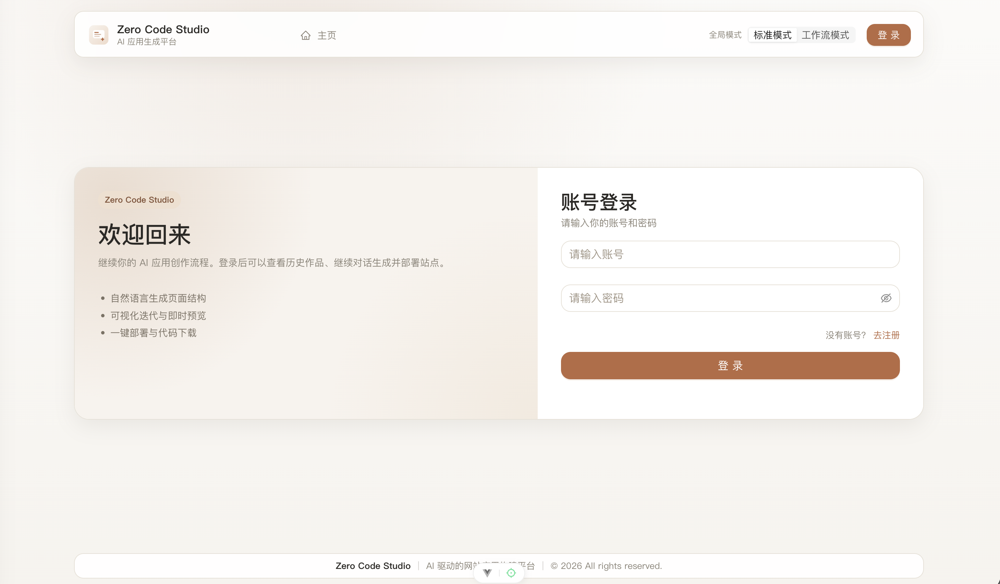

### 首页

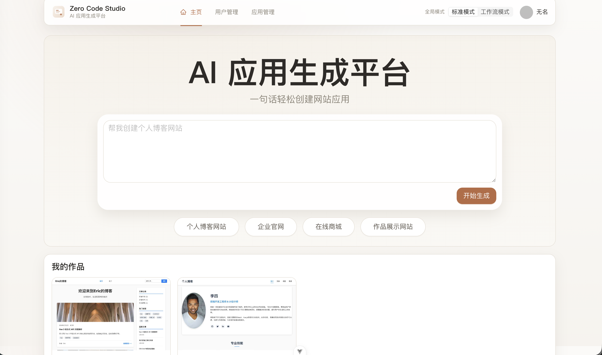
### TODO任务列表展示

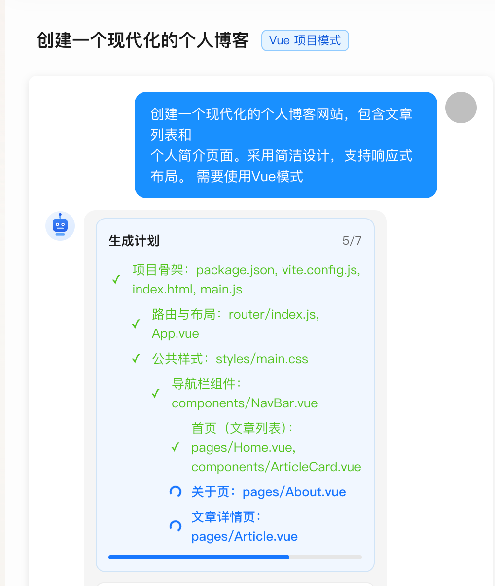
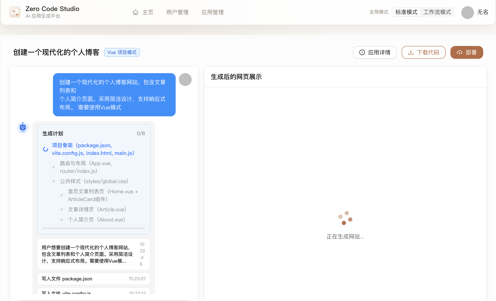

### 应用对话生成页


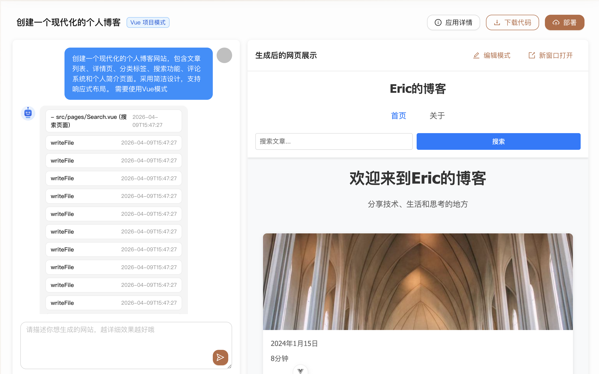

### 可视化编辑模式

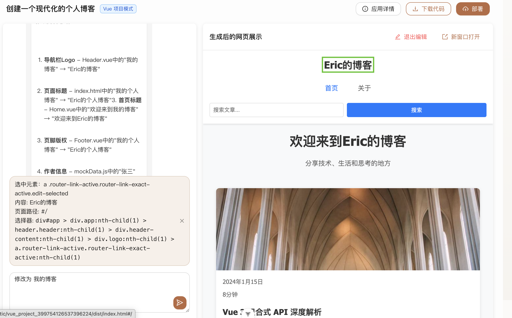

### 工具调用过程展示


### 一键部署结果页

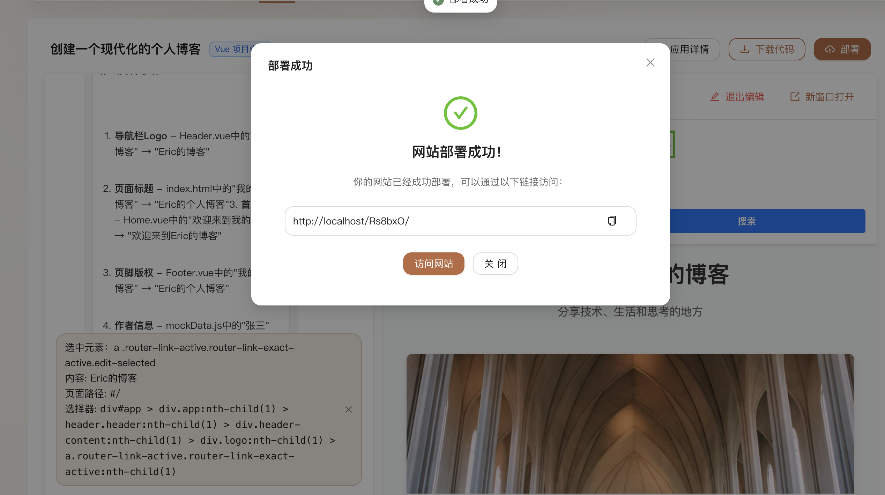
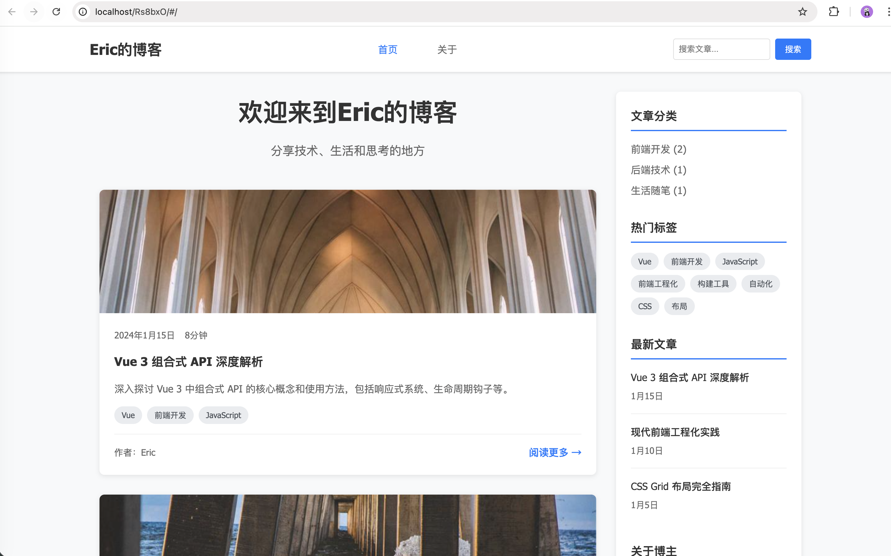


---

## Roadmap

- [x] 标准模式 + 工作流模式双引擎
- [x] 工具调用可观测化
- [x] 事件聚合落库与回放
- [x] patch 定点修改协议

---

## License

MIT

---

## Author

**Eric**

- 学历：UNSW IT 硕士 + 西南大学本科。
- 职业：Java 后端程序员。
- 博客：[代码丰](https://blog.csdn.net/qq_44716086)。
- 微信号：LQF-dev（随时欢迎骚扰）。

- 如果这个项目对你有帮助，欢迎点个 ⭐

---

## 更新记录

### 2026-04-30

- 新增`任务依赖计划`：设计思路是让 TODO 计划成为可表达依赖关系的任务图。模型在 `updatePlan` 中为任务声明 `deps`，后端校验依赖任务完成后才允许推进到 `in_progress`，前端按依赖层级展示计划进度。

- 新增`PlanTracker 状态管理`：设计思路是让后端只负责接收和保存模型提交的最新计划，不自动推断任务完成状态；每次 `updatePlan` 都会用新的 `items` 全量覆盖旧计划，并重置“连续未更新计划”的工具调用计数。
- 新增`计划更新提醒`：如果模型连续多次读写文件但没有调用 `updatePlan`工具，发送给大模型的提示词中会追加 reminder，提醒模型及时把当前任务标记为 `completed` 并推进下一个 `in_progress`。
- 新增`前端计划面板`：渲染 TODO 面板，展示任务完成数量、当前执行项和整体进度条。

### 2026-04-29

- 新增`上下文压缩机制`：设计思路是把 Redis 中的结构化会话记忆作为运行态上下文，在调用模型前优先压缩旧工具结果；当上下文继续增长到阈值后，再通过摘要压缩保留关键需求、决策、文件状态和未完成任务，减少长链路 Agent 反复回放大段工具结果的问题。
- 新增`DeepSeek V4-Pro 模型适配`：设计思路是顺应 DeepSeek V4 的统一模型模式，不再用 `deepseek-chat` / `deepseek-reasoner` 两套模型区分普通与推理，而是统一使用 `deepseek-v4-pro`，普通链路显式关闭 `thinking`，Vue 工程化生成链路开启 `thinking` 并配置更高推理强度。
- 新增`项目结构拆分`：设计思路是让单体、微服务、前端三个工程边界更清晰。根目录只保留聚合构建与公共说明，单体应用放入 `zero-code-monolith`，微服务应用保留在 `zero-code-microservice`，前端保留在 `zero-code-frontend`，便于后续独立演进和部署。
